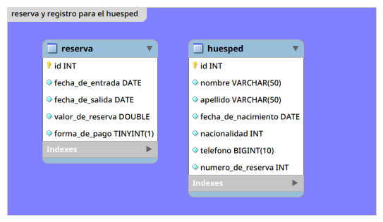
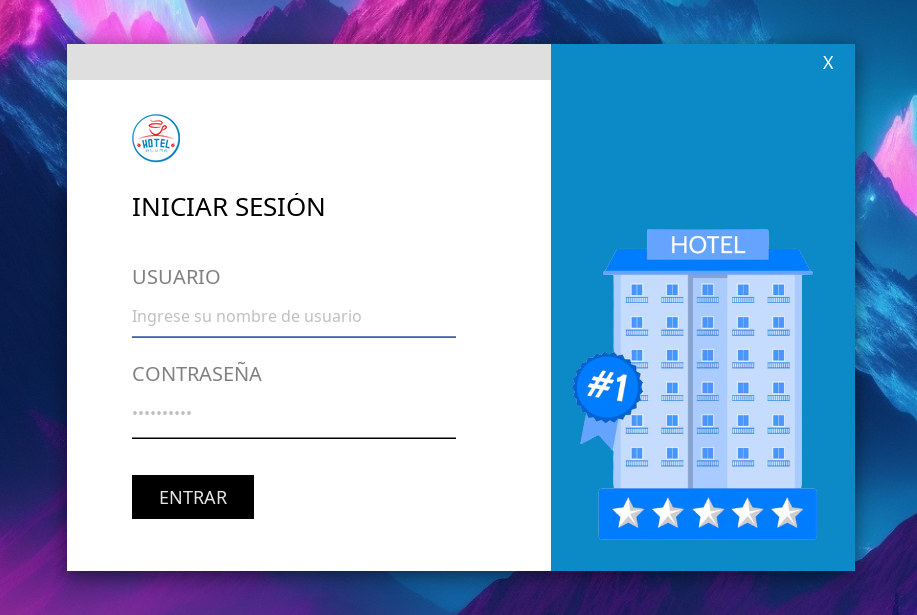

# HOTEL CHALLENGE

## Descripción
Proyecto realizado para completar el desafió de Alura.

## Novedad
- Se implemento la búsqueda por nombre del huésped.
- Se implemento el uso de Anotaciones como decoradores, solo que en este caso en vez de modificar su comportamiento, mas bien realiza una validación sobre los valores que se ingresan al modelo, si se comprueba que los valores están ajustados a las configuraciones previamente realizadas en las anotaciones, se procede con la invocación al método del controlador que se buscaba validar.

## Anotaciones Implementadas

| Anotaciones  	| Descripción                                                                                             	|
|--------------	|---------------------------------------------------------------------------------------------------------	|
| Validar      	| Esta anotación permitirá a la clase AnnotationDecorator luego de que realiza un escaneo implementar un control sobre los valores que se introduzca en el modelo. |
| Edad | Por el momento viene con un solo método que nos permitirá definir el mínimo de edad que el usuario pueda tener para interactuar con el método de nuestro controlador. |
| Teléfono | Viene con un solo método de nombre "longitud" que nos ayudara a comprobar que el valor agregado no sea ni superior ni inferior al valor establecido. |

### Ejemplo
Por el momento estas son las anotaciones que tendrá disponible el controlador y el modelo, mas adelante se depurara las lineas de código implementados.

#### Controlador
```java
public boolean guardar(@Validar HuespedModel huespedModel) {
    ...
}
```

#### Modelo
```java
@Edad(minima = 18)
private Date fechaDeNacimiento;
@Telefono(longitud = 10)
private long telefono;
```
Como se habrán fijado, esta anotación funcionara solo con el tipo de datos Date.

## Patrones de Diseños Utilizados

* Decorator **(Patron Estructural)**
* Factory **(Patron Creacional)**
* Data Access Object (DAO) **(Patron Estructural)**

## Arquitectura Utilizada
* Model View Controller (MVC)

## Base De Datos [old]

Debido a cambios de últimos momentos, en concreto del sistema operativo. Me vi obligado a cambiar de gestor de base de dato, de MySQL a MariaDB.

Se actualizo solamente el backup de "hotelchallenge-2"

## Base De Datos [new]

Una vez estabilizado el sistema, procedí a instalar nuevamente MySQL en su version 8.1. Quedara de recuerdo mientras tanto el script generado con MariaDB.

### Update
Se actualizo también el backup "hotelchallenge-1"

### Gestor de base de datos utilizado para generar los dos archivo .sql
```
"hotelchallenge-1" => "MySQL" (update)
"hotelchallenge-2" => "MariaDB" (new)
```

## Previsualización

primera ejecución en un entorno de gnome.

## Diagrama Entidad Relación [EER]


## Mantenimiento
<br>
'1. la primera llegada del hotel.

<br>
'2. mantenimiento del hotel.

## Insignia [Alura Challenge]


## Construido con 🛠️
* Java 17

## Autor ✒️
* **Usui, José Fernando** - *Desarrollo del Programa*

## Contacto 📱
* Gmail: _joesesilvae@gmail.com_
